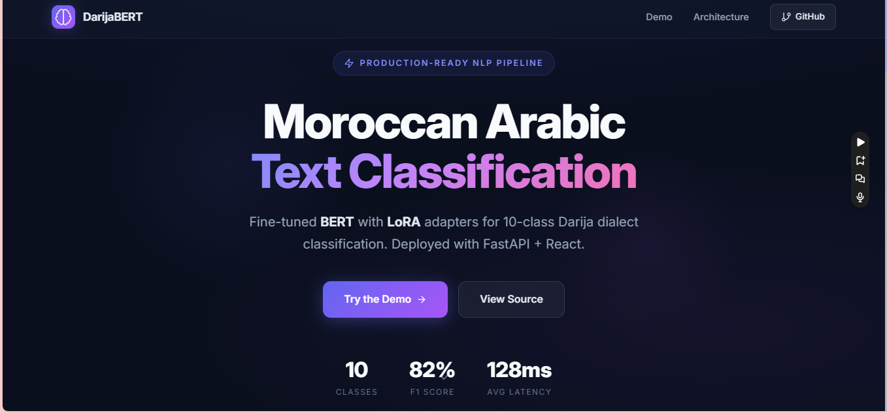
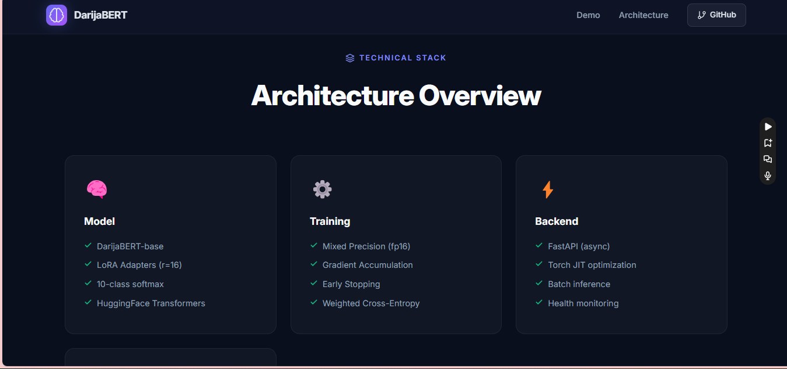
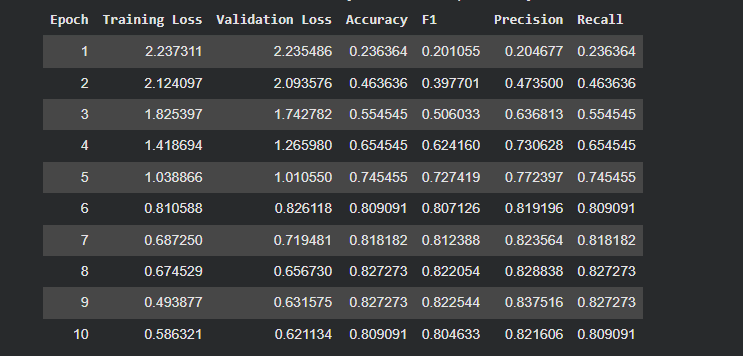
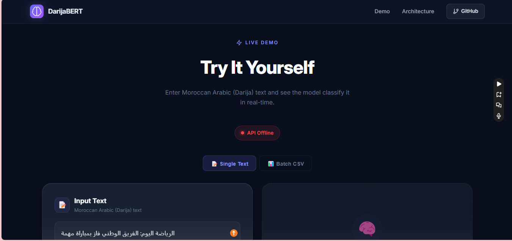
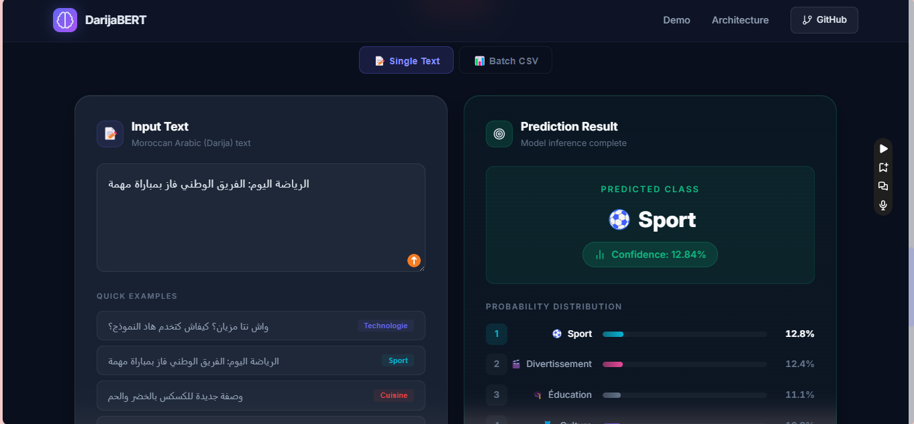
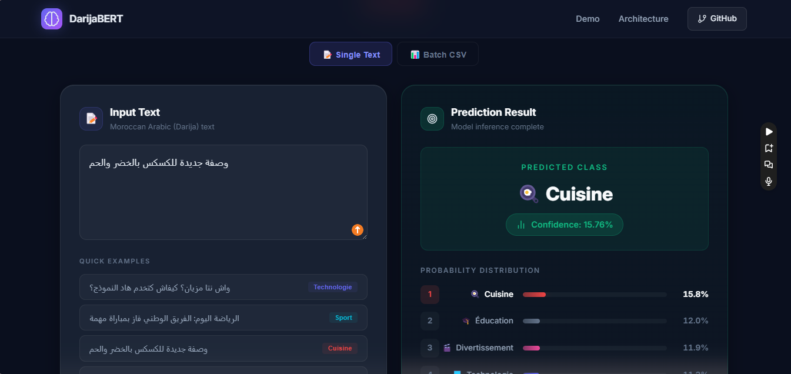
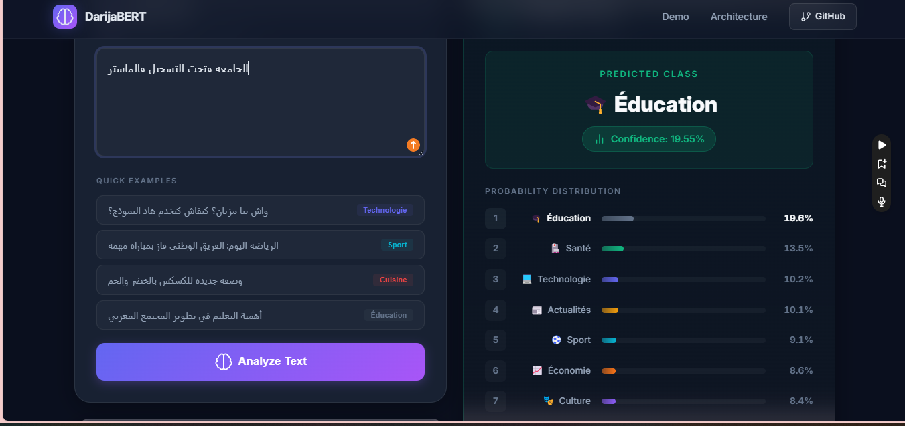

# 🧠 DarijaBERT — Moroccan Arabic Text Classifier

[](https://python.org/)
[](https://fastapi.tiangolo.com/)
[](https://react.dev/)
[](https://vitejs.dev/)
[](https://pytorch.org/)
[](https://huggingface.co/SI2M-Lab/DarijaBERT)
[](https://huggingface.co/HanaSoummar/DarijaBERT-finetuned_model_with_LORA)
[](#-license)

A production-ready NLP pipeline that fine-tunes **DarijaBERT** with **LoRA adapters** to classify Moroccan Arabic (Darija) text into 10 categories, served through a **FastAPI** backend and a polished **React** frontend.



---

## 📑 Table of Contents

- [✨ Overview](#-overview)
- [📁 Project Structure](#-project-structure)
- [🏗️ Architecture Overview](#️-architecture-overview)
- [🧪 Model Training](#-model-training)
- [📊 Results & Evaluation](#-results--evaluation)
- [🚀 Live Demo](#-live-demo)
- [🛠️ Setup & Run](#️-setup--run)
- [🔌 API Reference](#-api-reference)
- [🔐 Environment Variables](#-environment-variables)
- [📈 Possible Improvements](#-possible-improvements)
- [🧰 Tech Stack](#-tech-stack)
- [📄 License](#-license)

---

## ✨ Overview

| | |
|---|---|
|  **Task** | 10-class text classification |
|  **Language** | Moroccan Arabic (Darija) |
|  **Base model** | [`SI2M-Lab/DarijaBERT`](https://huggingface.co/SI2M-Lab/DarijaBERT) |
|  **Fine-tuning** | LoRA (Low-Rank Adaptation) |
|  **F1 Score** | **0.82** |
|  **Avg. latency** | ~128ms |
|  **Hosted model** | [`HanaSoummar/DarijaBERT-finetuned_model_with_LORA`](https://huggingface.co/HanaSoummar/DarijaBERT-finetuned_model_with_LORA) |

### 🏷️ Categories

| 📰 | 🍳 | 🏛️ | 🎭 | 🩺 | ⚽ | 💻 | ✈️ | 💰 | 🎓 |
|---|---|---|---|---|---|---|---|---|---|
| Actualités | Cuisine | Culture | Divertissement | Santé | Sport | Technologie | Voyage | Économie | Éducation |

---

## 📁 Project Structure

```
DarijaBert-Project/
├──  notebooks/
│   └── Finetuning.ipynb           # LoRA fine-tuning notebook
├──  data/
│   └── dataset_darija2.csv
├──  backend/
│   ├── main.py                    # FastAPI server
│   ├── requirements.txt
│   └── .env.example
├──  frontend/
│   ├── src/
│   │   ├── App.jsx
│   │   ├── index.css
│   │   └── main.jsx
│   ├── index.html
│   ├── package.json
│   ├── vite.config.js
│   └── .env.example
├──  docs/
│   └── screenshots/
├── .gitignore
└── README.md
```

---

## 🏗️ Architecture Overview



| Layer | Stack |
|---|---|
|  **Model** | DarijaBERT-base · LoRA adapters (`r=16`) · 10-class softmax head · 🤗Transformers |
|  **Training** | Mixed precision (fp16) · Gradient accumulation · Early stopping · Weighted cross-entropy |
|  **Backend** | FastAPI (async) · Torch JIT optimization · Batch inference · Health monitoring |

---

## 🧪 Model Training

### ⚙️ Configuration

| Parameter | Value |
|---|---|
|  Base model | `SI2M-Lab/DarijaBERT` |
|  LoRA rank (`r`) | 16 |
|  LoRA alpha | 32 |
|  LoRA dropout | 0.1 |
|  Target modules | `query`, `value`, `key`, `dense` |
|  Classifier head | Fully trained (`modules_to_save=["classifier"]`) |
|  Learning rate | `1e-4` |
|  Batch size | 16 |
|  Epochs | 10 |
|  Dataset | 447 unique examples (357 train / 90 validation) |

---

## 📊 Results & Evaluation



> 🏆 **Best checkpoint: Epoch 8** — Accuracy **82.7%**, F1 **0.822** — kept automatically via `load_best_model_at_end=True`.

✅ Train and validation loss decrease together across all 10 epochs, indicating **healthy learning without significant overfitting** for this dataset size.

### 🔍 Confusion Matrix Highlights

| Status | Insight |
|---|---|
| ✅ | `Cuisine`, `Sport`, `Technologie`, `Voyage`, `Santé` → near-perfect classification |
| ⚠️ | Most confusion occurs between **semantically overlapping categories**: `Actualités` ↔ `Économie` ↔ `Culture` ↔ `Éducation` — expected, since real-world articles often span multiple of these topics |
| 🏆 | **82.7% accuracy on a 10-class task with ~447 examples** is a strong result (random baseline ≈ 10%) |

---

## 🚀 Live Demo



### 🔎 Example Predictions

<table>
<tr>
<td></td>
<td></td>
</tr>
<tr>
<td align="center">⚽ <b>Sport</b> — "الرياضة اليوم: الفريق الوطني فاز بمباراة مهمة"</td>
<td align="center">🍳 <b>Cuisine</b> — "وصفة جديدة للكسكس بالخضر والحم"</td>
</tr>
</table>

<p align="center">

</p>
<p align="center">🎓 <b>Éducation</b> — "الجامعة فتحت التسجيل فالماستر"</p>

### 💡 Interface Features

- 📝 **Single text classification** with live probability distribution across all 10 classes
- 📂 **Batch CSV classification** for processing multiple texts at once
- ⚡ **Quick examples** to test the model instantly
- 🟢 **Real-time API health indicator**

---

## 🛠️ Setup & Run

### 1️⃣ Backend (FastAPI)

```bash
cd backend
python -m venv venv
venv\Scripts\activate        # Windows
# source venv/bin/activate   # Mac/Linux

pip install -r requirements.txt
cp .env.example .env          # configure HF_TOKEN, MODEL_ID, etc.

uvicorn main:app --reload --port 8000
```
- 🌐 API: http://localhost:8000
- 📘 Docs: http://localhost:8000/docs

### 2️⃣ Frontend (React + Vite)

```bash
cd frontend
npm install
cp .env.example .env          # configure VITE_API_URL

npm run dev
```
- 🌐 App: http://localhost:5173

### 3️⃣ Training Notebook

Open `notebooks/Finetuning.ipynb` in **Google Colab** (T4 GPU recommended 🚀) or Jupyter locally. The notebook:

1. Loads and preprocesses `data/dataset_darija2_expanded.csv`
2.  Tokenizes text with the DarijaBERT tokenizer
3.  Applies LoRA configuration to `SI2M-Lab/DarijaBERT`
4.  Trains and evaluates (accuracy, F1, precision, recall)
5.  Displays a confusion matrix
6.  Pushes the fine-tuned model to Hugging Face Hub

---

## 🔌 API Reference

| Method | Endpoint | Description |
|---|---|---|
| 🟢 `GET` | `/` | Health check + label list |
| 🟢 `GET` | `/labels` | List all 10 class labels |
| 🔵 `POST` | `/predict` | Classify a single text |
| 🔵 `POST` | `/predict/batch` | Classify a list of texts |

### `POST /predict`

```json
// Request
{ "text": "الرياضة اليوم: الفريق الوطني فاز بمباراة مهمة" }

// Response
{
  "predicted_label": "Sport",
  "confidence": 96.4,
  "scores": [
    { "label": "Sport", "probability": 0.964 },
    { "label": "Actualités", "probability": 0.021 }
  ]
}
```

---

## 🔐 Environment Variables

**`backend/.env`**
```env
HF_TOKEN=your_huggingface_write_token
MODEL_ID=HanaSoummar/DarijaBERT-finetuned_model_with_LORA
MAX_LEN=128
```

**`frontend/.env`**
```env
VITE_API_URL=http://localhost:8000
```

> ⚠️ `.env` files are excluded via `.gitignore`. Use `.env.example` as a template.

---

## 📈 Possible Improvements

-  Expand the dataset, especially for `Économie`, `Culture`, `Éducation`, and `Actualités` — the classes with most confusion
-  Refine labeling guidelines for texts that span multiple topics
-  Try higher LoRA rank (`r=32`) with early stopping over more epochs
-  Add data augmentation (paraphrasing, back-translation) for underrepresented classes

---

## 🧰 Tech Stack

| Category | Technologies |
|---|---|
|  **Model** | DarijaBERT · LoRA (PEFT) · PyTorch · 🤗 Transformers · Hugging Face Hub |
|  **Backend** | FastAPI · Uvicorn |
|  **Frontend** | React · Vite |
|  **Training** | Google Colab (T4 GPU) |

---

## 📄 License

This project is for educational purposes. The base model `SI2M-Lab/DarijaBERT` follows its own license terms on Hugging Face.

---
## 👨‍💻 About Me

I am a Data Science enthusiast focused on building end-to-end data projects and extracting actionable insights from data.

This project is part of my portfolio to demonstrate real-world analytics, data engineering, and business intelligence skills.


---

> ⭐ If you found this project useful, consider starring the repository — it helps others discover it too!

<br>

<p align="center">Made with ❤️ for Moroccan Darija NLP</p>